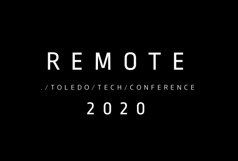

#  REMOTE 2020

### ./TOLEDO/TECH/CONFERENCE

#### ¿QUÉ ES TOLEDO TECH CONFERENCE ?

TOLEDO  TECH  CONFERENCE  ES  UN  EVENTO
QUE NACE CON VOCACIÓN DE GENERAR ANUALMENTE UN PUNTO DE ENCUENTRO DE DESARROLLADORES DE SOFTWARE EN TOLEDO Y QUE EN CA DA EDICIÓN GIRARÁ EN TORNO A UN ASPECTO CONCRETO DE ESTA PROFESIÓN, YA SEA TÉCNICO, MÉTODO LÓGICO O PROPIO DEL  EJERCICIO  PROFESIONAL, SOBRE EL QUE SE DE BATIRÁ CON EL OBJETO DE APRENDER, COMPARTIR Y DISFRUTAR.

#### NUESTRO SITIO WEB

VISITA NUESTRO [SITIO WEB ](http://www.toledotechconf.com) PARA MAS INFORMACIÓN

#### DOSSIER

ACCEDE A NUESTRO DOSSIER DESCARGÁNDOLO [AQUÍ](https://drive.google.com/file/d/1ZMCcftjqtheQDy34hLlk8DKScKLKhR0N/view?usp=sharing).

#### CONTRIBUYE

PUEDES VER COMO CONTRIBUIR LEYENDO NUESTRO [MANUAL](./CONTRIBUTING.md) PARA ELLO